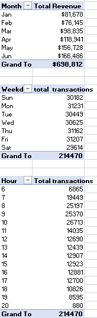
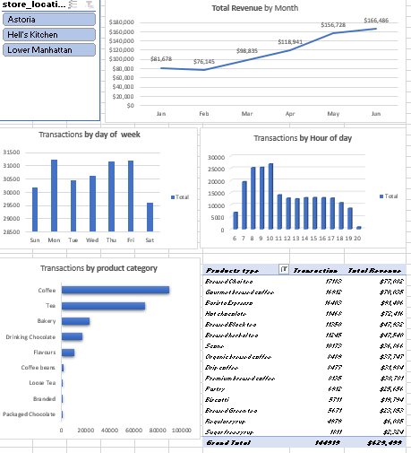

# coffee-shop sales analysis

#INTRODUCTION/PROJECT OVERVIEW
In the bustling world of retail, understanding customer preferences and sales trends is crucial for optimizing operations and enhancing profitability.The primary aim of this project focuses on analyzing transaction data from three coffee shops located in Lower Manhattan, Astoria and Hell’s Kitchen. In examining this data, we aim to identify trends in customer purchases, popular products, pricing strategies, and the overall sales performance of each store. This analysis will provide valuable insights into customer preferences and help inform future business strategies to enhance customer satisfaction and drive sales growth.
Data Source
Coffee Shop Sales raw file.xlsx: This dataset used for this analysis contains detailed transaction records from a coffee shop, including transaction IDs, dates, times, quantities, store locations, product IDs, unit prices, product categories, product types, and product details. The data covers transactions from multiple store locations from January to June 2023. The dataset was provided as an excel file by the company
Data Description
The dataset comprises detailed transaction records from three coffee shops over a specified period. The data includes the following columns: • transaction_id: A unique identifier for each transaction. • transaction_date: The date when the transaction took place. • transaction_time: The exact time the transaction occurred. • transaction_qty: The quantity of items purchased in the transaction. • store_id: An identifier for the store where the transaction was made. • store_location: The location of the store • product_id: A unique identifier for each product sold. • unit_price: The price per unit of the product. • product_category: The category to which the product belongs (e.g., Coffee, Tea, Bakery). • product_type: A specific type of product within the category (e.g., Gourmet brewed coffee, Brewed Chai tea). • product_detail: Additional details about the product (e.g., Ethiopia Rg, Spicy Eye Opener Chai Lg). This dataset provides a comprehensive view of the sales transactions, allowing for in-depth analysis of purchasing patterns and product performance across different store locations. By leveraging this data, we can uncover actionable insights to optimize product offerings, improve customer experience, and enhance overall business operations
Problem Statement
1.	Total Sales by Product Category: Summarizing total sales for each product category.
2.	Total Revenue by Store Location: Calculating the total revenue generated by each store location.
3.	Sales Trends Over Time: Analyzing sales data over time to identify trends.
4.	Transactions by day of the week and hour of the day
5.	Total Sales by Product Category: Determine the total sales for each product category
6.	Total Revenue by Product Category: Calculate the total revenue generated by each product category.
7.	Total Revenue by Store Location: Calculate the total revenue generated by each store location
8.	Total Revenue by Product Type: Determine the total revenue generated by each product type
9.	Top 15 products by transaction and revenue
10.	Hourly Sales Trends: Analyze sales trends by hour to identify peak times for transactions.
11.	Sales Trends Over the Day: Identify how sales vary throughout the day.
12.	Revenue Trends Over the Day: Identify revenue trends throughout the day.
________________________________________
Skills/Concepts Demostrated
Data Cleaning and Preparation
•	Data Filtering and Sorting
•	Conditional Formatting
•	Text Functions
•	Date and Time Functions
•	Data Validation Data Analysis
•	Pivot Tables
•	Pivot Charts:
•	Formulas and Functions Visualization
•	Charts and Graphs
•	Slicers and Timelines
•	Advanced Analysis Reporting and Dashboarding
•	Dashboard Creation

Data Cleaning/Transformation
In the initial data preparation phase, we performed the following task:
1.	Added a column for Revenue using the operator =D2*H2
2.	Added a column for month using =MONTH(B2)
3.	Added a column for monthName using =TEXT(B2,"mmm")
4.	Added a column for weekday using =WEEKDAY(B2,2)
5.	Added a column for weekdasyName using =TEXT(B2,"ddd")
6.	Added a column for Hour using =HOUR(C2)
Analysis and Summaries with Pivot Tables
1.	Total Revenue per Month
•	Rows: Month
•	Values: Sum of unit_price * transaction_qty
•	This analysis will show the total Revenue revenue generated in each Month.
2.	Total Transaction per Day of Week
•	Rows: weekdayName
•	Values: Count of Transaction_id
•	This analysis will show the count of transactions each week day.
3.	Total Transaction by hour of Day
•	Rows: Hour
•	Values: Count of Transaction_id
•	This analysis will show the count of transactions each week day.
4.	Total Transaction per product category
•	Rows: product_category
•	Values: Count of Transaction_id
•	This analysis will show the count of transactions per product_category sorted descending by transaction
5.	Number of transactions and revenue by product_type sorted in descending order and filtered to the top 15(by transaction)
•	Rows: product_type
•	Values: Count of Transaction_id, Sum of Revenue
•	This analysis will show the count of transactions and Sum of Revenue per product_type sorted descending by transaction

PIVOT TABLE

VISUALIZATION

